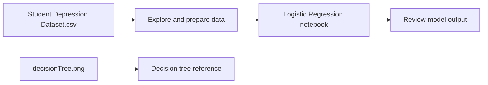

<div align="center">

# Student Depression Analysis

**Exploring student data and applying Logistic Regression**


</div>

---

## Overview

This project explores the **Student Depression Dataset** and uses a Jupyter Notebook to work through a Logistic Regression exercise.

The dataset contains student information that can be examined for patterns related to depression. The repository includes the CSV dataset, the analysis notebook, a `model` folder, and a decision tree image.

This project is for educational and analytical purposes. Its results should not be used to diagnose mental health conditions or replace professional support.

## Project Objectives

- Explore the student depression dataset.
- Prepare data for a machine learning exercise.
- Apply Logistic Regression to the dataset.
- Review model-related files and the included decision tree visualization.
- Practice working with a classification problem in Python.

## Dataset

The repository includes `Student Depression Dataset.csv`. The dataset contains student records and attributes related to areas such as demographics, academic life, and lifestyle.

The target field represents depression status. The notebook uses the dataset for an educational classification exercise.

## Workflow



## Repository Structure

```text
StudentsDepressionDataset/
├── LogisticRegressionHomework.ipynb
├── Student Depression Dataset.csv
├── decisionTree.png
└── model/
```

| File or folder | Description |
|---|---|
| `LogisticRegressionHomework.ipynb` | Jupyter Notebook for the Logistic Regression exercise. |
| `Student Depression Dataset.csv` | Dataset used by the notebook. |
| `decisionTree.png` | Decision tree visualization included in the repository. |
| `model/` | Folder containing model-related project files. |

## Technologies

- **Python** — programming language
- **Jupyter Notebook** — interactive environment for analysis
- **scikit-learn** — machine learning tools
- **Pandas** — working with tabular data

## Getting Started

### Requirements

- Python 3
- Jupyter Notebook or JupyterLab
- The Python libraries used in the notebook

### Run the notebook

1. Clone the repository:

   ```bash
   git clone https://github.com/cristina1200/StudentsDepressionDataset.git
   ```

2. Open the project folder:

   ```bash
   cd StudentsDepressionDataset
   ```

3. Install the main packages used for data analysis and machine learning:

   ```bash
   pip install pandas scikit-learn jupyter
   ```

4. Start Jupyter Notebook:

   ```bash
   jupyter notebook
   ```

5. Open `LogisticRegressionHomework.ipynb` and run the cells in order.

Keep `Student Depression Dataset.csv` in the project folder so the notebook can access it.

## Limitations

- The notebook is an educational exercise, not a clinical assessment tool.
- Dataset patterns do not establish that a particular factor causes depression.
- Model performance depends on the data, preprocessing, and evaluation method used in the notebook.
- Predictions should not be treated as medical advice.

## Author

**Cristina Fatan**  
[GitHub Profile](https://github.com/cristina1200)
